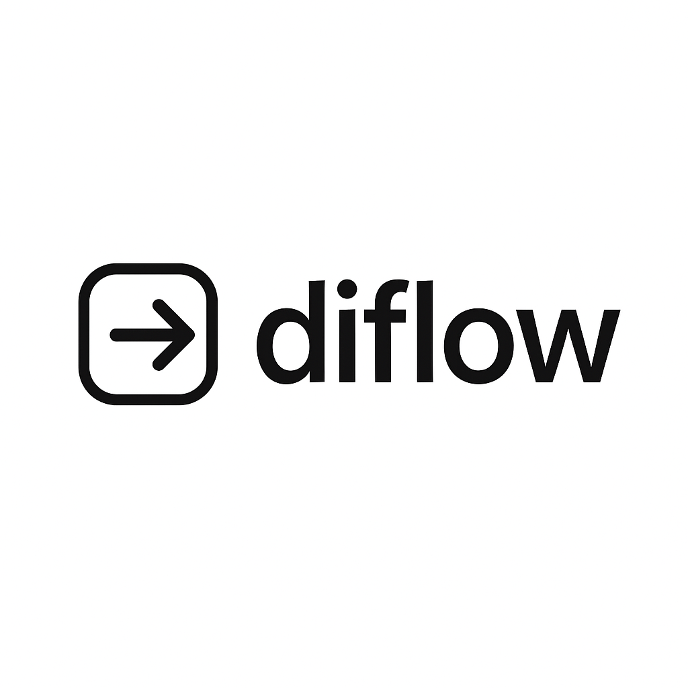

# diflow-js – Complete Library Guide
<p align="center"></p>

> Dependency-injected flows & message bus helpers for **TypeScript** projects of any size

---

## 📚 Table of Contents

1. [Introduction](#introduction)
2. [Quick Start](#quick-start)
3. [Core Concepts](#core-concepts)
   * [Command vs Query](#command-vs-query)
   * [Transports](#transports)
4. [API Reference](#api-reference)
   * [`CommandSource`](#class-commandsource)
   * [`QueryBus`](#class-querybus)
   * [`ITransport`](#interface-itransport)
   * [`IQueryTransport`](#interface-iquerytransport)
   * [`LocalTransport`](#class-localtransport)
   * [`LocalQueryTransport`](#class-localquerytransport)
5. [End-to-End Example](#end-to-end-example)
6. [Extending diflow-js](#extending-diflow-js)
7. [FAQ](#faq)

---

## Introduction

diflow-js is built around the **Command/Query Responsibility Segregation** (CQRS) pattern and the principle of keeping all side-effects behind well-typed adapters.  
The library ships a handful of minimal primitives—no decorators, no Reflect-metadata, <1 kB gzipped—that you can compose into rich, dependency-injected data flows that work the same way in the browser, Node, or serverless.

> **Primary Goal – Source Visibility**  
> Whenever a module mutates state through a command, diflow-js lets you see *every* possible source of that change at a glance. Each command includes a strongly-typed, human-readable `source` field injected by `CommandSource`, so mutation origins stay explicit, traceable, and easy to audit in large codebases.

If you are new to CQRS or dependency-injected flows, start with the **Quick Start**; afterwards dive into the **API Reference** where every class and interface is documented with code samples.

---

## Quick Start

Install:

```bash
npm i diflow-js
```

Create a *command* type and a matching *response* type:

```ts
// types.ts
export type CreateDeckPayload = { name: string };
export type CreateDeckResponse = { newDeckId: number };

export type CreateDeckCommand = {
  type: 'CreateDeck';
  source: string;   // filled automatically by CommandSource
  payload: CreateDeckPayload;
};
```

Wire a command source with a transport and register a handler:

```ts
import { CommandSource } from 'diflow-js';
import { LocalTransport } from 'diflow-js';
import { CreateDeckCommand, CreateDeckResponse } from './types';

const deckSource = new CommandSource<CreateDeckCommand, CreateDeckResponse>(
  'DeckModal',              // human-readable source name
  new LocalTransport(),     // process-local transport implementation
);

deckSource.registerHandler(async (cmd) => {
  console.log(`Saving deck '${cmd.payload.name}'…`);
  /* …persist to DB… */
  return { newDeckId: 42 };
});


```ts
// sync handler → immediate result
const id = deckSource.trigger({
  type: 'CreateDeck',
  payload: { name: 'Physics' },
});
console.log(id); // → 42

// async handler → Promise
const asyncId = await deckSource.trigger({
  type: 'CreateDeck',
  payload: { name: 'Chemistry' },
});
console.log(asyncId); // → 43
```

For *queries* you would use `QueryBus` + `LocalQueryTransport`, see the [End-to-End Example](#end-to-end-example).

---

## Core Concepts

### Command vs Query

* **Command** – expresses an intention to *change* the system. Commands are sent via `CommandSource` and handled exactly once.
* **Query** – asks the system for *information* without mutating it. Queries are sent via `QueryBus` and answered with a response.

### Transports

A *transport* moves commands or queries between producers and handlers. diflow-js ships with in-process transports:

* `LocalTransport` – for commands (sync **and** async)
* `LocalQueryTransport` – for queries

You can implement your own transports (e.g. NATS, RabbitMQ, HTTP) by adhering to `ITransport` / `IQueryTransport`.

---

## API Reference

### Class: `CommandSource`

```ts
new CommandSource<TCommand, TResponse>(name, transport)
```

| Param | Type | Description |
|-------|------|-------------|
| `name` | `string` | Human-readable identifier automatically injected into every command (`source` field). |
| `transport` | `ITransport<TCommand, TResponse>` | Transport implementation used to deliver commands. |

#### Methods

* `registerHandler(handler)` – subscribe a single *sync or async* function that will process every incoming command.
* `trigger(command)` – send a command (minus the `source` field, which is filled in for you) and **either** return the handler’s response immediately or return a Promise depending on whether the handler is synchronous or asynchronous.

---

### Class: `QueryBus`

Analogous to `CommandSource` but for read-only queries.

* `registerHandler(handler)` – subscribe a single query handler.
* `trigger(query)` – send a query and await its response.

---

### Interface: `ITransport`

```ts
type TCommandReturn<T> = T | Promise<T>;

interface ITransport<TCommand, TResponse> {
  send(cmd: TCommand): TCommandReturn<TResponse>;
  on(handler: (cmd: TCommand) => TCommandReturn<TResponse>): void;
}
```

Implement this interface to add new command transports.

---

### Interface: `IQueryTransport`

Same contract as `ITransport` but for *queries*.

---

### Class: `LocalTransport`

A zero-dependency, in-memory implementation of `ITransport` suited for tests, serverless functions, and monoliths.

---

### Class: `LocalQueryTransport`

In-memory query counterpart of `LocalTransport`.

---

## End-to-End Example

The repository ships two runnable examples:

```bash
node example/Example.ts            # command example
node example/GetDecksQuery.ts      # query example (to be implemented)
```

Below is a condensed version of the command example:

```ts
import { CommandSource, LocalTransport } from 'diflow-js';
import { TCreateDeckCommand, TCreateDeckResponse } from './CreateDeckCommand';

const source = new CommandSource<TCreateDeckCommand, TCreateDeckResponse>(
  'Modal',
  new LocalTransport(),
);

source.registerHandler(async (cmd) => {
  console.log(`[LOCAL HANDLER] ${cmd.payload.name}`);
  return { newDeckId: 777 };
});

const res = await source.trigger({
  type: 'CreateDeck',
  payload: { name: 'Physics' },
});
console.log(res.newDeckId);
```

---

## Extending diflow-js

* **New transports** – implement `ITransport`/`IQueryTransport` to plug in NATS, RabbitMQ, or WebSockets.
* **Middlewares** – wrap your transport’s `send` / `on` methods to add logging, retries, or metrics.
* **Type utilities** – use `Omit<TCommand, 'source'>` (as seen in `CommandSource.trigger`) to prevent callers from polluting the `source` field.

---

## FAQ

**Q: Can I register multiple handlers per command type?**  
Not at the moment—`registerHandler` stores exactly one handler. If you need fan-out, create a custom transport or emit *events* instead of *commands*.

**Q: Where are the flows and adapters mentioned in the top-level README?**  
diflow-js’ long-term roadmap includes higher-level helpers (`defineFlow`, `defineAdapter`). The current NPM package provides the low-level message-bus primitives described above.

**Q: Does it work in the browser?**  
Yes! All shipped code is ECMAScript-compliant and free of Node-specific APIs.

---

Happy coding – and may your flows be evergreen! ✨
